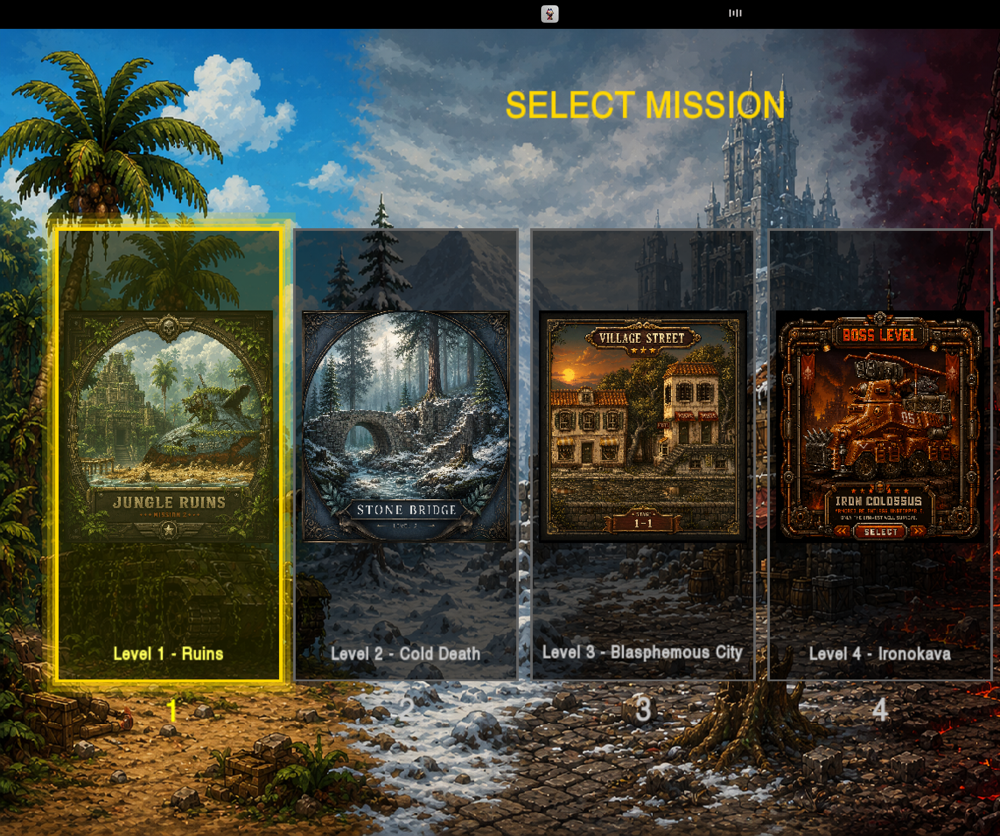
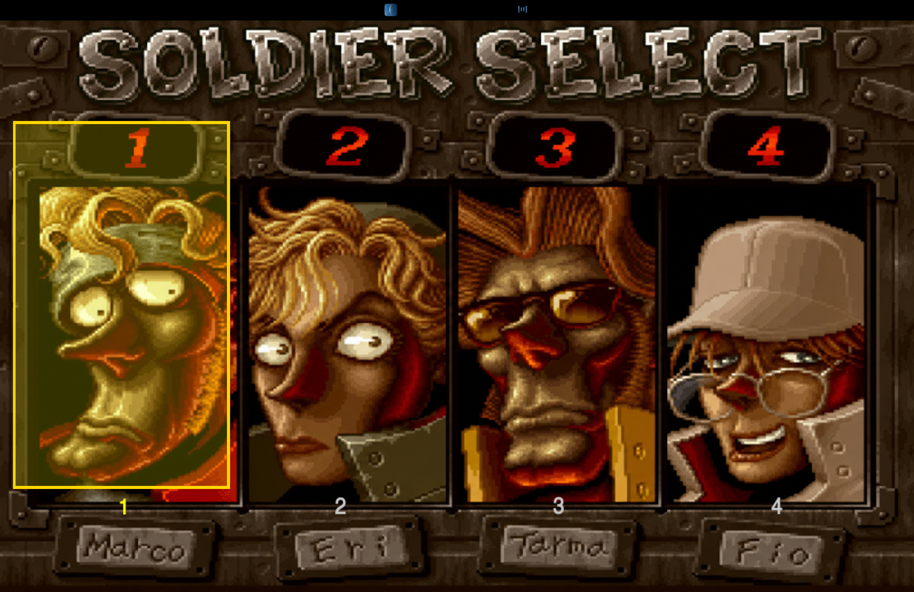
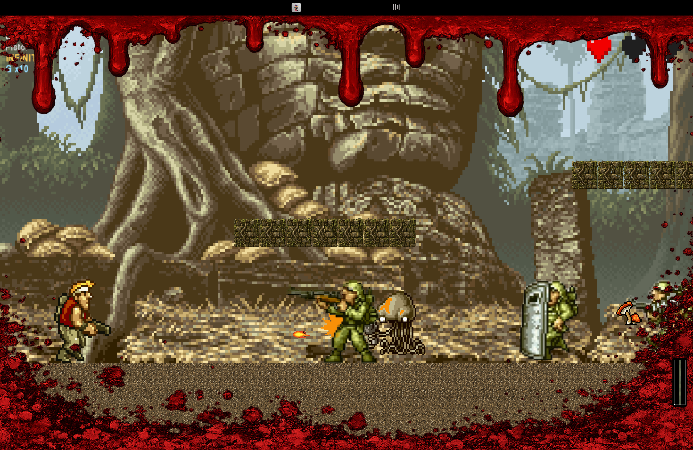

# Metal Slug — OOP Project (Spring 2026)

A run-and-gun game built from scratch in C++ with SFML, for the CS-1004 Object Oriented Programming course at FAST-NUCES. Built with a partner over a few intense weeks (right in the middle of finals season and three other projects, so the scope here is what we actually got working and tested, not a wishlist).

The whole thing runs on a hand-written object model — no STL containers, no `string`, and only a restricted subset of SFML was allowed. So a lot of what's normally one library call here is our own code instead.



## What it is

It's a 2D side-scroller in the spirit of the original Metal Slug. You pick one of four soldiers, drop into a level, and fight your way to the right through infantry, undead, aliens, vehicles, and a boss at the end. There are two completely different ways to play:

- **Survival** — three fixed, hand-designed levels (Ruins, Cold Death, Blasphemous City) followed by a boss stage. Enemy positions are baked into each level.
- **Campaign** — a single procedurally generated world. The terrain comes out of a Perlin/fractal noise generator we wrote ourselves.



## The design (this is the part the project was actually about)

Almost every system here is a class hierarchy with a polymorphic interface, because that was the whole point of the course. A few of the parts I'm happiest with:

**One entity tree.** Everything that lives in the world descends from an abstract `Entity`, and everything that can be hurt descends from `DamagableEntity`. Players, enemies, bosses, vehicles, and blocks all share the same `update` / `draw` / `takeDamage` contract, so the game loop never needs to know what it's actually looking at.

**Characters as subclasses.** `PlayerSoldier` is abstract; Marco, Tarma, Eri, and Fio each inherit from it and override their own input handling, sprite logic, and special power-up. Their buffs and weaknesses live in the subclass — Marco's dual-fire, Tarma's vehicle immunity, Eri's double-grenade throw, Fio's supercharge — instead of a giant switch statement somewhere.

**Weapons and enemies are pure polymorphism.** Every weapon (pistol, heavy machine gun, rocket launcher, flame shot, laser) overrides a single virtual `fire()`. Every enemy overrides `updateAI()` and `performAttack()`. The shielded soldier even overrides `takeDamageFrom()` so it can ignore frontal hits, which falls out of the design for free.

**The vehicle tree uses virtual inheritance.** Ground, aerial, and aquatic vehicles all virtually inherit from `Vehicle` specifically so an amphibious slug can be all three at once without the diamond-inheritance problem duplicating its base. This was the trickiest design call in the project and it's the thing I'd point an instructor at first.

**Transformations are a State pattern.** When the player gets hit by a zombie or mummy they switch into `UndeadState` or `MummyState`, which change movement and weapon rules and then expire on a timer. `NormalState` is a singleton since there's only ever one of it.

There's also a stack-based `GameStateManager` driving the menu / play / pause / game-over / character-select screens, and score/high-score persistence through file handling.



## Features that made it in

- Two game modes (Survival + procedural Campaign)
- Four playable characters, each with unique stats and a timed special ability
- Full enemy roster: rebel, shielded, bazooka, and grenade soldiers, paratroopers, martians, zombies, and mummy warriors
- Three bosses — Iron Nokana (ground), Hairbuster (aerial), and Sea Satan (aquatic), each with their own attack patterns
- Enemy and player vehicles
- Weapon pickups, grenades, and supply crates
- The damage protocol from the spec: healthy → injured → critical → dead, with a translucent red screen hue on hit (visible in the shot above)
- Undead and mummy transformation states
- Mouse aiming across the full 0–90° arc
- Collectibles: food, POW prisoners, supply crates
- Scoring with melee/aerial/multi-kill bonuses, combos, and a saved high score

## Built with

- **C++17**
- **SFML 2.5** (graphics, window, system, audio) — restricted to the allowed object subset only
- **CMake** for the build
- No STL: custom string helpers (`Ourstring.h`) and a custom `Vector2d`

## Building it

You'll need SFML 2.5 and CMake 3.16+.

```bash
mkdir build && cd build
cmake ..
cmake --build .
```

On Windows, pass your SFML path with `-DSFML_DIR=<path-to-SFML>/lib/cmake/SFML`. Run the executable from the project root so it can find the `resources/` folder.

## Notes

This was a partner project. What is here is the full core game and the procedural campaign, and it all runs.
